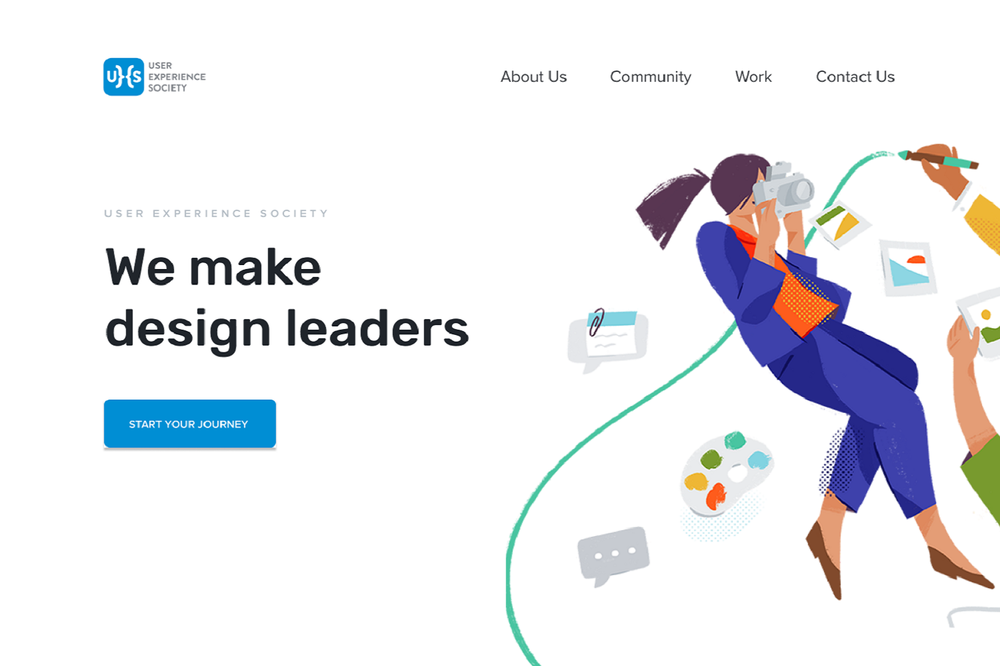

# UXSoc Theme

This theme is a Hugo port of [the UXSoc website](https://www.figma.com/file/Vf6nbxqkHCDFzFrYn2z3Ux5W/UXSoc-Website). It is meant to be a theme for other UXSoc chapters to start their own chapter website. Chapters should use this Hugo theme to gain visibility on-campus, help with recruitment, and provide chapter-specific information to members.



## Intended Use

Different UXSoc chapters from around the world serve different purposes, and so the website was designed to be modular with its design. In this theme, you would be able to enable and disable particular sections to what your chapter needs.

For example, the [Chapman University chapter](https://www.facebook.com/UXSocChapmanU) needed a way to update its members about ongoing projects. So, in this theme, we included a projects section that is essentially like a blog that project managers in the chapter can update on a weekly basis. The chapter also needed a way to display its members portfolios, so we also added a members section that displays a list of all current and previous members' portfolios, all made clickable for to individually view.

## Installation

Follow the themes guide on the [Hugo website](https://gohugo.io/themes/installing-and-using-themes/). Briefly, within your Hugo folder:

```sh
$ cd themes
$ git clone https://github.com/xaviablaza/hugo-uxsoc-theme.git
```

## Getting started

Copy everything within `exampleSite` into the root of your website folder, and edit it to your hearts content!

If you're lazy, you can do this within the `themes` folder:
```sh
$ cp -r hugo-uxsoc-theme/exampleSite/* ../
```

Add `theme = "hugo-uxsoc-theme"` to the  `config.toml` in your root folder, or when serving, use `hugo server -t hugo-uxsoc-theme`

## Adding a new case study

At the root of your Hugo site, you can use
```sh
$ hugo new mypost.md
```
to generate a new case study post. To find the post, you can go to `content/mypost.md` and you can use that file to write details about your case study and the body of your case study in markdown.

## Credits

Credits for this theme go to Laura Ang, Jiggy Villanueva, and their team at the User Experience Society Ateneo de Manila University (UXSoc ADMU). Maraming matsala for design work.
